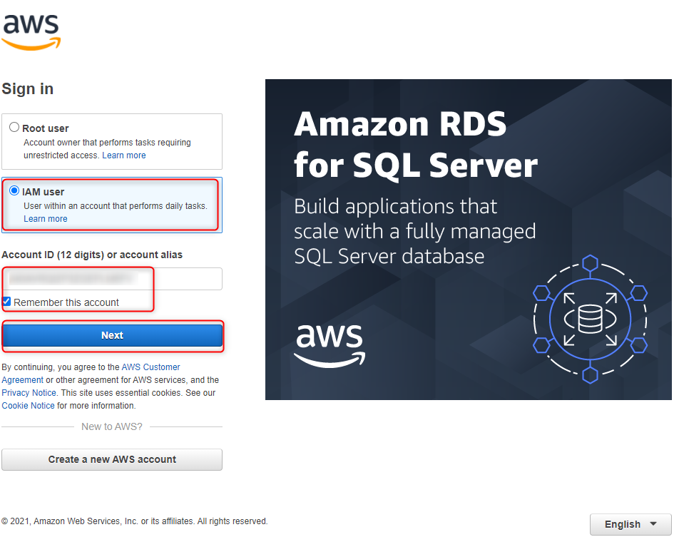

TODO
----

* remove s3 scrip
* install aws cli

USAGE
-----

Steps:
1. Create AWS EC2 using CloudFormation stack with `./scripts/cloudformation/ec2/create-ec2-stack.sh`
1. Create AWS CodeDeploy using CloudFormation stack with `./scripts/cloudformation/codedeploy/create-codedeploy-stack.sh`
1. Create AWS S3 bucket with `./scripts/s3/create-s3.sh`
1. (Optional) Remove DOS signs from file "install.sh" with `dos2unix scripts/codedeploy/install.sh`
1. Build and copy package with code to AWS S3 with `./scripts/s3/copy-deployment-to-s3.sh`
     * It assumes thay you have zipping tool "7z" installed in location "/C/IT/7-Zip/7z.ex". If you have tool in other location then please update file "/scripts/s3/copy-deployment-to-s3.sh" with this new location
1. Start deployment from AWS S3 to AWS EC2 with `./scripts/codedeploy/create-deployment.sh`
1. Verify service HelloWorld via service Gateway with `http://{ec2-public-IPv4-address}:8762`
1. (Optional) Verify service HelloWorld directly with `http://{ec2-public-IPv4-address}:8080`
1. (Optional) Verify service Discovery with `http://{ec2-public-IPv4-address}:8761`
1. Clean up AWS
     * Delete AWS EC2 using CloudFormation stack with `./scripts/cloudformation/ec2/delete-ec2-stack.sh`
     * Delete AWS CodeDeploy using CloudFormation stack with `./scripts/cloudformation/codedeploy/delete-codedeploy-stack.sh`
     * Delete AWS S3 with `./scripts/s3/delete-s3.sh`

DESCRIPTION
-----------

##### Goal
The goal of this project is to present how to deploy **microservices** on **AWS** cloud service type **EC2**. These microservices are created in **Java** programming language with usage **Spring Boot Cloud** framework. Docker images of these microservices are built with usage **docker compose** tool. Configuration of AWS EC2 is done by **AWS Code Deploy**. 

AWS Code Deploy takes code from AWS S3 as ZIP package and deploys it on AWS EC2. Endpoint for deployment is file **appspec.yml** (copies resources from package to AWS EC2) and this file redirects action to file **install.sh** (installation resources on AWS EC2).

##### Services
This project consists of following services:
* **Service Discovery**: port **8761**. This service contains information about all services registered in the system. Main tasks:
     * **Checking status**: this service can be used to check status of services in the system 
     * **Load balancing**: this service can be used by load balancers to identify services and their instances in the system
* **Service Gateway**: port **8762**. This service redirects traffic from outside system to inside system. Main tasks:
     * **Redirecting**: this service can redirect requests from outside system to some services inside system
     * **Load balancing**: this service can take care of load balancing requests from outside system to services inside system basing on information from service Discovery
* **Service HelloWorld**: port **8080**. This service provides message, port and uuid

##### Flow
The following flow takes place in this project:
1. User via Browser sends request to Service Gateway for content
1. Service Gateway sends request to Service HelloWorld for content
1. Service HelloWorld sends back response to Service Gateway with message, port and uuid
1. Service Gateway sends back response to User via Browser with message, port and uuid

##### Launch
To launch this application please make sure that the **Preconditions** are met and then follow instructions from **Usage** section.

##### Technologies
This project uses following technologies:
* **Java**: `https://docs.google.com/document/d/119VYxF8JIZIUSk7JjwEPNX1RVjHBGbXHBKuK_1ytJg4/edit?usp=sharing`
* **Maven**: `https://docs.google.com/document/d/1cfIMcqkWlobUfVfTLQp7ixqEcOtoTR8X6OGo3cU4maw/edit?usp=sharing`
* **Git**: `https://docs.google.com/document/d/1Iyxy5DYfsrEZK5fxZJnYy5a1saARxd5LyMEscJKSHn0/edit?usp=sharing`
* **Spring Boot**: `https://docs.google.com/document/d/1mvrJT5clbkr9yTj-AQ7YOXcqr2eHSEw2J8n9BMZIZKY/edit?usp=sharing`
* **Microservices**: `https://docs.google.com/document/d/1j_lwf5L0-yTPew75RIWcA6AGeAnJjx0M4Bk4DrUcLXc/edit?usp=sharing`
* **Docker**: `https://docs.google.com/document/d/1tKdfZIrNhTNWjlWcqUkg4lteI91EhBvaj6VDrhpnCnk/edit?usp=sharing`
* **Docker Compose**: `https://docs.google.com/document/d/1SPrCS5OS_G0je_wmcLGrX8cFv7ZkQbb5uztNc9kElS4/edit?usp=sharing`
* **AWS**

PRECONDITIONS
-------------

##### Preconditions - Tools
* Installed **Operating System** (tested on Windows 10)
* Installed **7Zip**

##### Preconditions - Actions
* Created AWS account 
* Created IAM user with EC2 permissions. Please check section **CONFIGURATION AWS ACCOUNT**

CONFIGURATION AWS ACCOUNT
-------------------------

