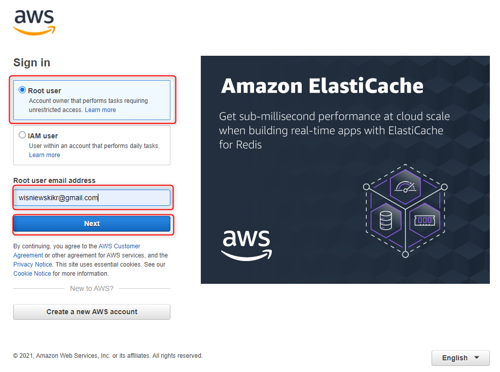
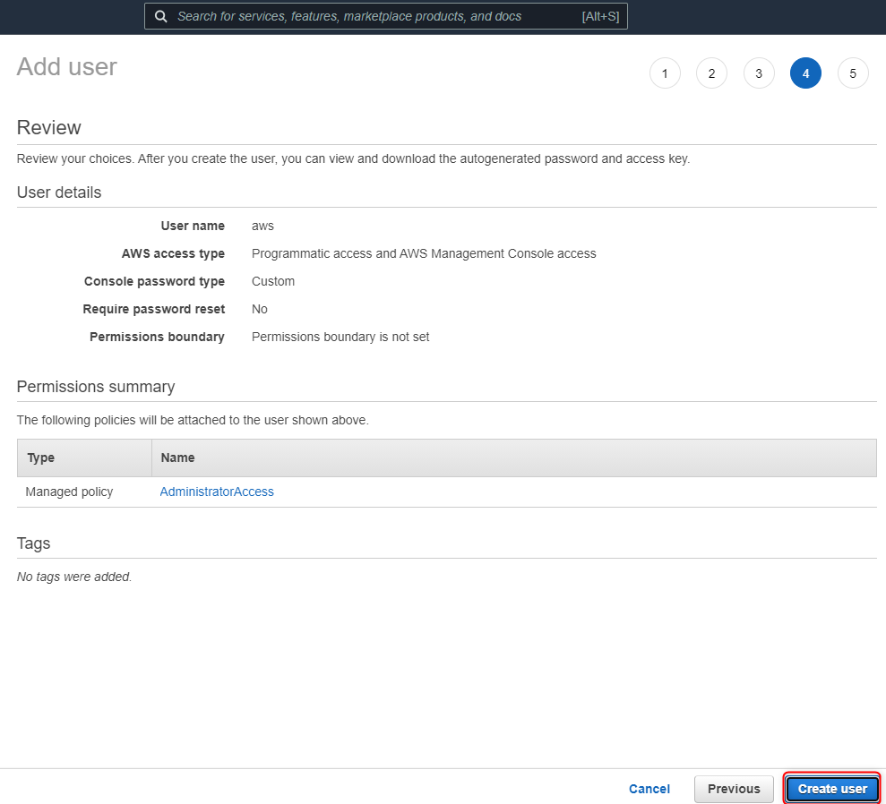

USAGE
-----

> **NOTE** Please use **bash** command line tool (for instance "Git Bash").

Steps:
1. Create AWS elements with `.\create-stack.sh`
1. Check AWS stack status. Please check section **USAGE CLOUD FORMATION**
1. Check AWS EC2. Please check section **USAGE EC2**
1. Test microservices (ports: 8761, 8762, 8080). Please check section **USAGE BROWSER**
1. Remove all AWS elements with `.\delete-stack.sh`

DESCRIPTION
-----------

##### Goal
The goal of this project is to present how to deploy **microservices** on **AWS** cloud service type **EC2**. These microservices are created in **Java** programming language with usage **Spring Boot Cloud** framework. Docker images of these microservices are built with usage **docker compose** tool. Configuration of AWS EC2 is done automatically by **AWS Cloud Formation** service.

##### Services
This project consists of following services:
* **Service Discovery**: port **8761**. This service contains information about all services registered in the system. Main tasks:
     * **Checking status**: this service can be used to check status of services in the system 
     * **Load balancing**: this service can be used by load balancers to identify services and their instances in the system
* **Service Gateway**: port **8762**. This service redirects traffic from outside system to inside system. Main tasks:
     * **Redirecting**: this service can redirect requests from outside system to some services inside system
     * **Load balancing**: this service can take care of load balancing requests from outside system to services inside system basing on information from service Discovery
* **Service HelloWorld**: port **8080**. This service provides message, port and uuid

##### Flow
The following flow takes place in this project:
1. User via Browser sends request to Service Gateway for content
1. Service Gateway sends request to Service HelloWorld for content
1. Service HelloWorld sends back response to Service Gateway with message, port and uuid
1. Service Gateway sends back response to User via Browser with message, port and uuid

##### Launch
To launch this application please make sure that the **Preconditions** are met and then follow instructions from **Usage** section.

##### Technologies
This project uses following technologies:
* **Java**: `https://docs.google.com/document/d/119VYxF8JIZIUSk7JjwEPNX1RVjHBGbXHBKuK_1ytJg4/edit?usp=sharing`
* **Maven**: `https://docs.google.com/document/d/1cfIMcqkWlobUfVfTLQp7ixqEcOtoTR8X6OGo3cU4maw/edit?usp=sharing`
* **Git**: `https://docs.google.com/document/d/1Iyxy5DYfsrEZK5fxZJnYy5a1saARxd5LyMEscJKSHn0/edit?usp=sharing`
* **Spring Boot**: `https://docs.google.com/document/d/1mvrJT5clbkr9yTj-AQ7YOXcqr2eHSEw2J8n9BMZIZKY/edit?usp=sharing`
* **Microservices**: `https://docs.google.com/document/d/1j_lwf5L0-yTPew75RIWcA6AGeAnJjx0M4Bk4DrUcLXc/edit?usp=sharing`
* **Docker**: `https://docs.google.com/document/d/1tKdfZIrNhTNWjlWcqUkg4lteI91EhBvaj6VDrhpnCnk/edit?usp=sharing`
* **Docker Compose**: `https://docs.google.com/document/d/1SPrCS5OS_G0je_wmcLGrX8cFv7ZkQbb5uztNc9kElS4/edit?usp=sharing`
* **AWS**

PRECONDITIONS
-------------

##### Preconditions - Tools
* Installed **Operating System** (tested on Windows 10)
* Installed **AWS Cli**

##### Preconditions - Actions
* Created AWS account 
* Created IAM user with EC2 permissions. Please check section **CREATE IAM USER**

USAGE CLOUD FORMATION
---------------------

AWS Console:
* https://console.aws.amazon.com/

USAGE EC2
---------

AWS Console:
* https://console.aws.amazon.com/

USAGE BROWSER
--------------

> NOTE: Please replace value "54.165.37.73" with your cluster id. You can find it in section "USAGE EC2".

CREATE IAM USER
---------------

