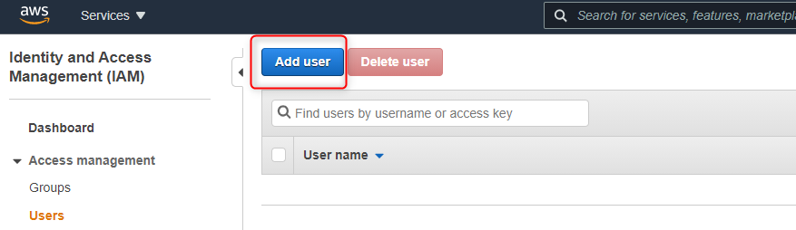

USAGE
-----

Steps:
1. Configure AWS EC2. Cluster of AWS EC2 is set up. Docker and docker compose are installed there. Please check section **USAGE EC2**
1. Configure AWS Security Group. Ports of services have to be opened. Please check section **USAGE SECURITY GROUP**
1. Generate PPK file from PEM file. Please check section **USAGE PUTTYGEN**
1. Deploy file "docker-compose.yaml" on AWS EC2. Please check section **USAGE WINSCP**
1. Start docker containers on AWS EC2. Please check section **USAGE PUTTY**
1. Test solution in the browser. Please check section **USAGE BROWSER**


DESCRIPTION
-----------

##### Goal
The goal of this project is to present how to deploy **microservices** on **AWS** cloud service type **EC2**. These microservices are created in **Java** programming language with usage **Spring Boot Cloud** framework. Docker images of these microservices are built with usage **docker compose** tool. Configuration of AWS EC2 is done manually. Deployment YAML file and usage docker compose is done by SSH.

##### Services
This project consists of following services:
* **Service Discovery**: port **8761**. This service contains information about all services registered in the system. Main tasks:
     * **Checking status**: this service can be used to check status of services in the system 
     * **Load balancing**: this service can be used by load balancers to identify services and their instances in the system
* **Service Gateway**: port **8762**. This service redirects traffic from outside system to inside system. Main tasks:
     * **Redirecting**: this service can redirect requests from outside system to some services inside system
     * **Load balancing**: this service can take care of load balancing requests from outside system to services inside system basing on information from service Discovery
* **Service HelloWorld**: port **8080**. This service provides message, port and uuid

##### Flow
The following flow takes place in this project:
1. User via Browser sends request to Service Gateway for content
1. Service Gateway sends request to Service HelloWorld for content
1. Service HelloWorld sends back response to Service Gateway with message, port and uuid
1. Service Gateway sends back response to User via Browser with message, port and uuid

##### Launch
To launch this application please make sure that the **Preconditions** are met and then follow instructions from **Usage** section.

##### Technologies
This project uses following technologies:
* **Java**: `https://docs.google.com/document/d/119VYxF8JIZIUSk7JjwEPNX1RVjHBGbXHBKuK_1ytJg4/edit?usp=sharing`
* **Maven**: `https://docs.google.com/document/d/1cfIMcqkWlobUfVfTLQp7ixqEcOtoTR8X6OGo3cU4maw/edit?usp=sharing`
* **Git**: `https://docs.google.com/document/d/1Iyxy5DYfsrEZK5fxZJnYy5a1saARxd5LyMEscJKSHn0/edit?usp=sharing`
* **Spring Boot**: `https://docs.google.com/document/d/1mvrJT5clbkr9yTj-AQ7YOXcqr2eHSEw2J8n9BMZIZKY/edit?usp=sharing`
* **Microservices**: `https://docs.google.com/document/d/1j_lwf5L0-yTPew75RIWcA6AGeAnJjx0M4Bk4DrUcLXc/edit?usp=sharing`
* **Docker**: `https://docs.google.com/document/d/1tKdfZIrNhTNWjlWcqUkg4lteI91EhBvaj6VDrhpnCnk/edit?usp=sharing`
* **Docker Compose**: `https://docs.google.com/document/d/1SPrCS5OS_G0je_wmcLGrX8cFv7ZkQbb5uztNc9kElS4/edit?usp=sharing`
* **AWS**


PRECONDITIONS
-------------

##### Preconditions - Tools
* Installed **Operating System** (tested on Windows 10)
* Installed **Putty** (tested on version 0.78)
* Installed **PuttyGen** (tested on version 0.78)
* Installed **WinSCP** (tested on version 5.21.7)

##### Preconditions - Actions
* Created AWS account 
* Created IAM user with EC2 permissions. Please check section **CREATE IAM USER**


USAGE EC2
---------

AWS Console:
* https://console.aws.amazon.com/

Code in section "User Data":

```
#!/bin/bash
set -x
yum update -y

# Install Docker
amazon-linux-extras install docker -y
service docker start
systemctl enable docker
usermod -a -G docker ec2-user
 chmod 666 /var/run/docker.sock

# Install Docker Compose
curl -L https://github.com/docker/compose/releases/download/v2.16.0/docker-compose-$(uname -s)-$(uname -m) -o /usr/local/bin/docker-compose
chmod +x /usr/local/bin/docker-compose

```


USAGE SECURITY GROUP
--------------------

AWS Console:
* https://console.aws.amazon.com/


USAGE PUTTYGEN
--------------


USAGE WINSCP
------------

> NOTE: Please replace value "100.25.164.251" with your cluster id. You can find it in section "USAGE EC2". 


USAGE PUTTY
-----------

> NOTE: Please replace value "100.25.164.251" with your cluster id. You can find it in section "USAGE EC2". 


USAGE BROWSER
-------------

> NOTE: Please replace value "100.25.164.251" with your cluster id. You can find it in section "USAGE EC2". 


CREATE IAM USER
---------------





