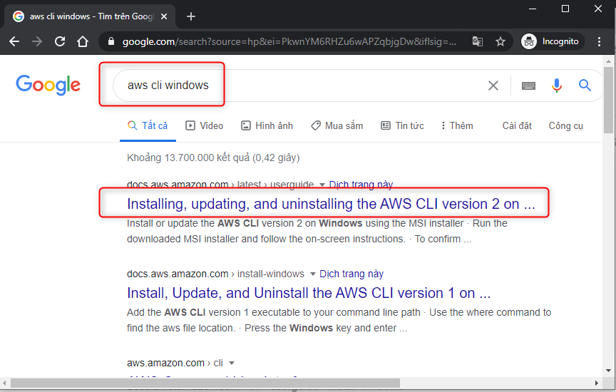
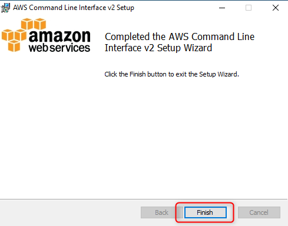

USAGE
-----

> **NOTE** This usage assumes that user has created **AWS account** and he/she is connected with this account via **AWS Cli**. User uses also **Windows PowerShell** command line tool. Please be aware that all AWS elements will be installed in zone **us-east-1**.

Steps:
1. Create new AWS docker context with `docker context create ecs myecs`
1. Use arrows to choose **An existing AWS profile**
1. Switch to new AWS docker context with `docker context use myecs` 
1. (Optional) Check AWS docker contexts with `docker context ls`
1. Launch microservices with `docker compose up`
1. Clean up AWS
     * Remove microservices with `docker compose down`

DESCRIPTION
-----------

##### Goal
The goal of this project is to present how to deploy **microservices** on **AWS** cloud service type **ECS**. These microservices are created in **Java** programming language with usage **Spring Boot Cloud** framework. Docker images of these microservices are built with usage **docker compose** tool.

Please be aware that AWS ECS works only on Docker Images deployed on some public repository. It's not possible to create Docker Image from the scratch here.

Please be aware that Gateway API does not work here. AWS ECS uses it's own Load Balancer. 

##### Services
This project consists of following services:
* **Service HelloWorld**: port **8080**. This service provides message, port and uuid

##### Flow
The following flow takes place in this project:
1. User via Browser sends request to Service HelloWorld for content
1. Service HelloWorld sends back response to User via Browser with message, port and uuid

##### Launch
To launch this application please make sure that the **Preconditions** are met and then follow instructions from **Usage** section.

##### Technologies
This project uses following technologies:
* **Java**: `https://docs.google.com/document/d/119VYxF8JIZIUSk7JjwEPNX1RVjHBGbXHBKuK_1ytJg4/edit?usp=sharing`
* **Maven**: `https://docs.google.com/document/d/1cfIMcqkWlobUfVfTLQp7ixqEcOtoTR8X6OGo3cU4maw/edit?usp=sharing`
* **Git**: `https://docs.google.com/document/d/1Iyxy5DYfsrEZK5fxZJnYy5a1saARxd5LyMEscJKSHn0/edit?usp=sharing`
* **Spring Boot**: `https://docs.google.com/document/d/1mvrJT5clbkr9yTj-AQ7YOXcqr2eHSEw2J8n9BMZIZKY/edit?usp=sharing`
* **Microservices**: `https://docs.google.com/document/d/1j_lwf5L0-yTPew75RIWcA6AGeAnJjx0M4Bk4DrUcLXc/edit?usp=sharing`
* **Docker**: `https://docs.google.com/document/d/1tKdfZIrNhTNWjlWcqUkg4lteI91EhBvaj6VDrhpnCnk/edit?usp=sharing`
* **Docker Compose**: `https://docs.google.com/document/d/1SPrCS5OS_G0je_wmcLGrX8cFv7ZkQbb5uztNc9kElS4/edit?usp=sharing`
* **AWS**

PRECONDITIONS
-------------

##### Preconditions - Tools
* Installed **Operating System** (tested on Windows 10)
* Installed **AWS Cli**. Please check section **INSTALL AWS CLI**
* Installed **bash** command line tool (for instance "Git Bash")

##### Preconditions - Actions
* Created AWS account 
* Created IAM user with EC2 permissions. Please check section **CONFIGURATION AWS ACCOUNT**

CONFIGURATION AWS ACCOUNT
-------------------------

INSTALL AWS CLI
---------------

