USAGE
-----

> **NOTE** This usage assumes that user has created **AWS account**. User uses also **Windows PowerShell** command line tool. Please be aware that all AWS elements will be installed in zone **us-east-1**.

Steps:
1. Configure AWS EC2. Please check section **CONFIGURATION AWS EC2**
1. Use AWS EC2 console. Please check section **CONSOLE AWS EC2**
     * Start Minikube with `minikube start`
     * Deploy microservices with `kubectl apply -f https://github.com/wisniewskikr/chrisblog-it-aws/blob/main/kubernetes/springcloud-helloworld-aws-kubernetes-ec2-minikube/kubernetes.yaml`
     * Get microservice URL with `minikube service helloworld-service`
     * Verify microservice with `curl {microservice-url}`
1. Clean up AWS
     * Termiante AWS EC2. Please check section **TERMINATE AWS EC2** 


DESCRIPTION
-----------

##### Goal
The goal of this project is to present how to deploy **microservices** on **AWS** cloud service type **EC2**. These microservices are created in **Java** programming language with usage **Spring Boot Cloud** framework. Docker images of these microservices are built with usage **Kubernetes** tool type **minikube**.

##### Services
This project consists of following services:
* **Service HelloWorld**: port **8080**. This service provides message, port and uuid

##### Flow
The following flow takes place in this project:
1. User via Browser sends request to Service HelloWorld for content
1. Service HelloWorld sends back response to User via Browser with message, port and uuid

##### Launch
To launch this application please make sure that the **Preconditions** are met and then follow instructions from **Usage** section.

##### Technologies
This project uses following technologies:
* **Java**: `https://docs.google.com/document/d/119VYxF8JIZIUSk7JjwEPNX1RVjHBGbXHBKuK_1ytJg4/edit?usp=sharing`
* **Maven**: `https://docs.google.com/document/d/1cfIMcqkWlobUfVfTLQp7ixqEcOtoTR8X6OGo3cU4maw/edit?usp=sharing`
* **Git**: `https://docs.google.com/document/d/1Iyxy5DYfsrEZK5fxZJnYy5a1saARxd5LyMEscJKSHn0/edit?usp=sharing`
* **Spring Boot**: `https://docs.google.com/document/d/1mvrJT5clbkr9yTj-AQ7YOXcqr2eHSEw2J8n9BMZIZKY/edit?usp=sharing`
* **Microservices**: `https://docs.google.com/document/d/1j_lwf5L0-yTPew75RIWcA6AGeAnJjx0M4Bk4DrUcLXc/edit?usp=sharing`
* **Docker**: `https://docs.google.com/document/d/1tKdfZIrNhTNWjlWcqUkg4lteI91EhBvaj6VDrhpnCnk/edit?usp=sharing`
* **Docker Compose**: `https://docs.google.com/document/d/1SPrCS5OS_G0je_wmcLGrX8cFv7ZkQbb5uztNc9kElS4/edit?usp=sharing`
* **AWS**


PRECONDITIONS
-------------

##### Preconditions - Tools
* Installed **Operating System** (tested on Windows 10)


##### Preconditions - Actions
* Created AWS account 


CONFIGURATION AWS EC2
---------------------

AWS link:
* https://console.aws.amazon.com/

User Data:

```
#!/bin/bash
yum update -y

# Install Docker
amazon-linux-extras install docker -y
service docker start
systemctl enable docker
usermod -a -G docker ec2-user
chmod 666 /var/run/docker.sock

# Install kubectl
curl -LO https://storage.googleapis.com/kubernetes-release/release/`curl -s https://storage.googleapis.com/kubernetes-release/release/stable.txt`/bin/linux/amd64/kubectl
chmod +x ./kubectl
mv ./kubectl /usr/local/bin/kubectl

# Install minikube
curl -Lo minikube https://storage.googleapis.com/minikube/releases/latest/minikube-linux-amd64
chmod +x minikube
mv minikube /usr/local/bin/minikube
```


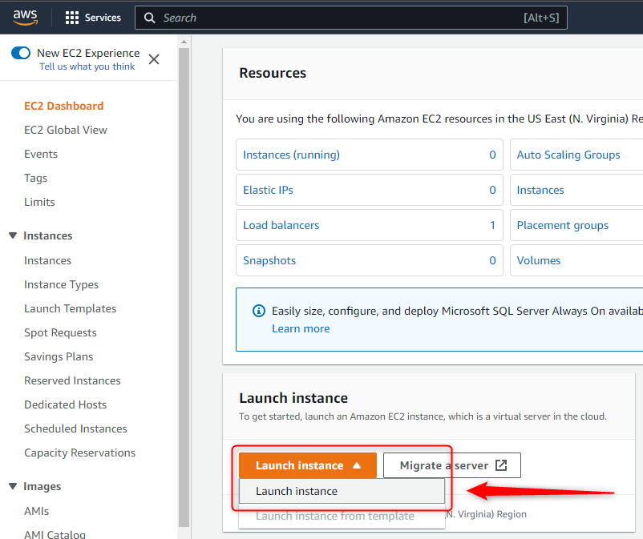

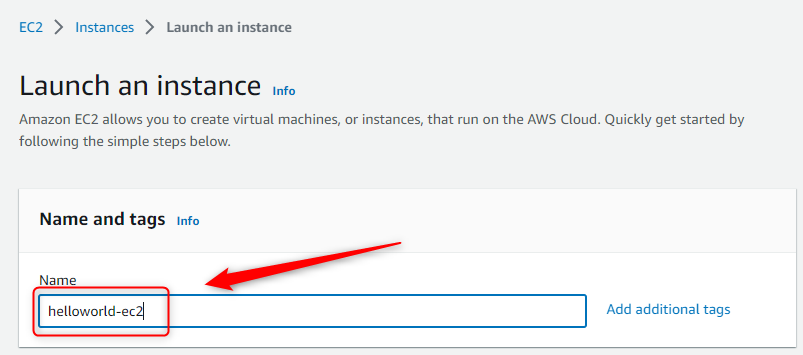

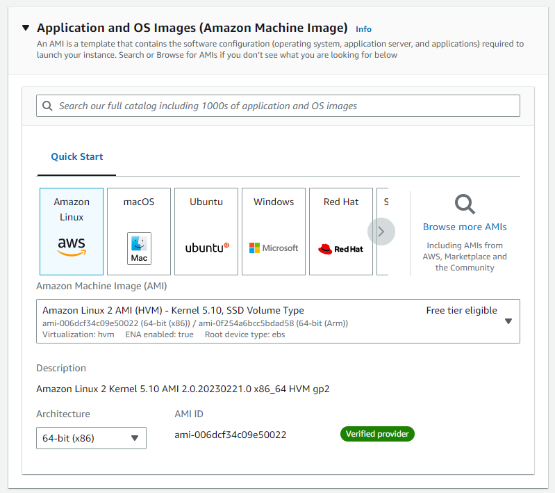

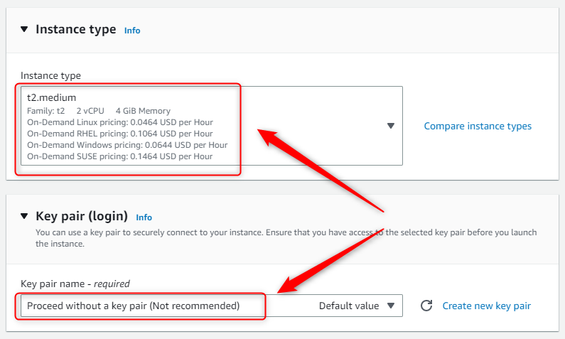

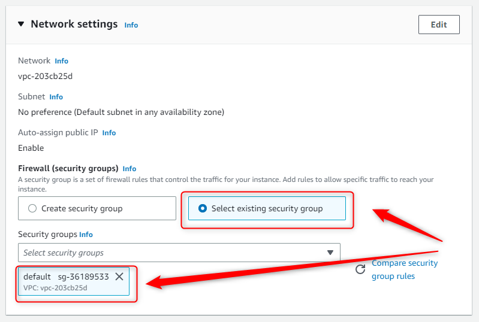

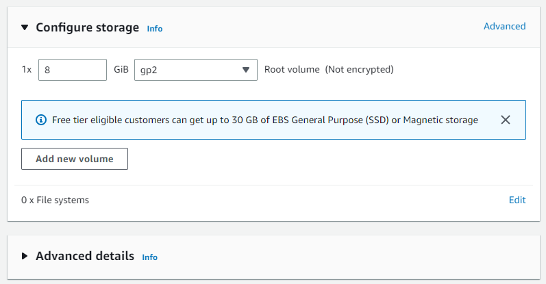

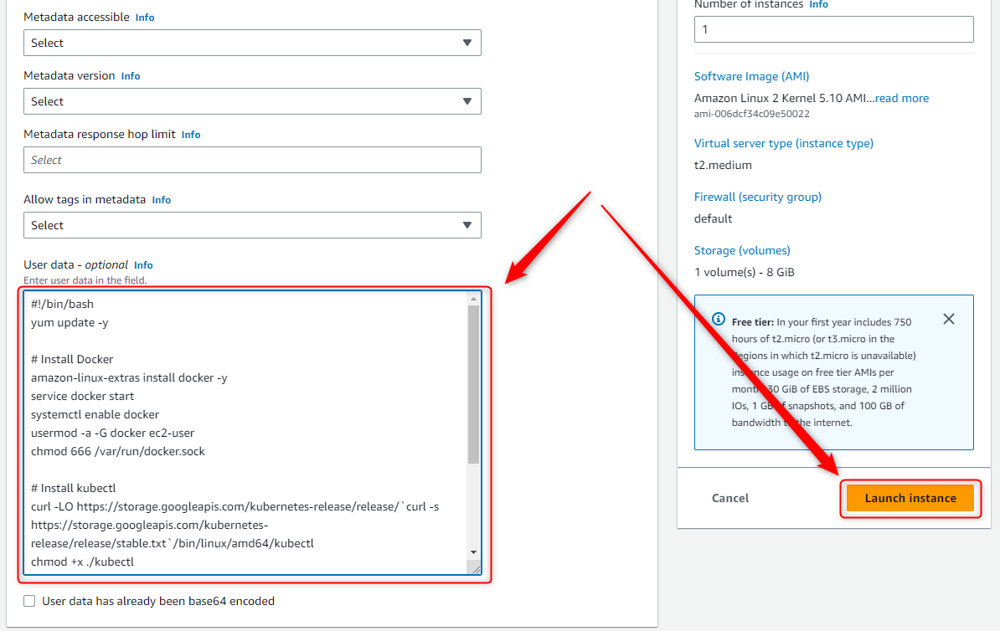

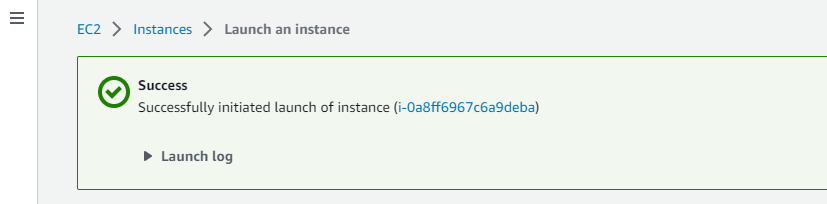


CONSOLE AWS EC2
---------------

AWS link:
* https://console.aws.amazon.com/


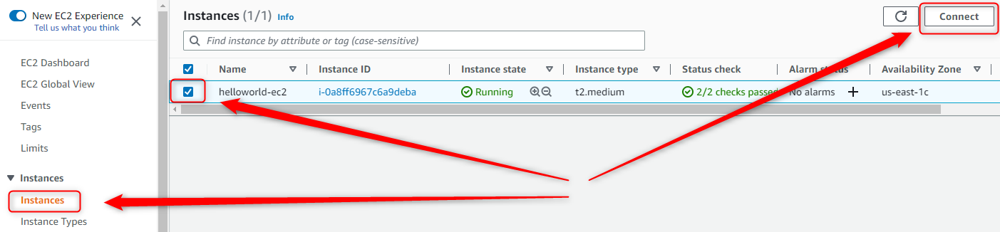

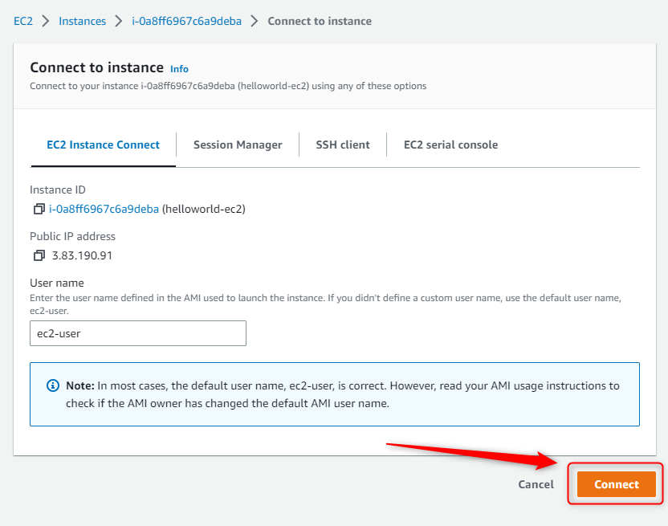

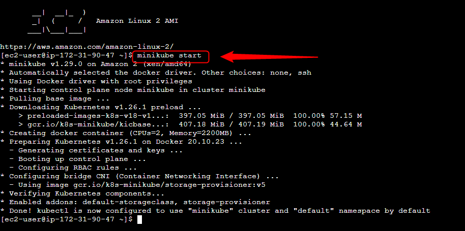

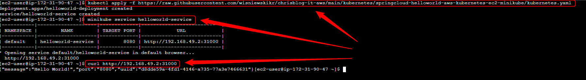


TERMINATE AWS EC2
------------------

AWS link:
* https://console.aws.amazon.com/

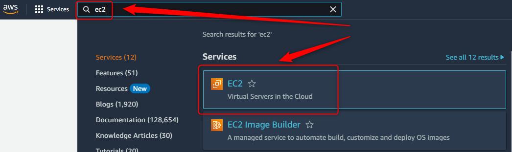

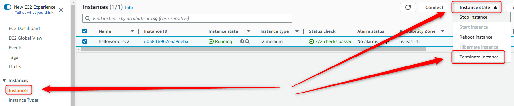

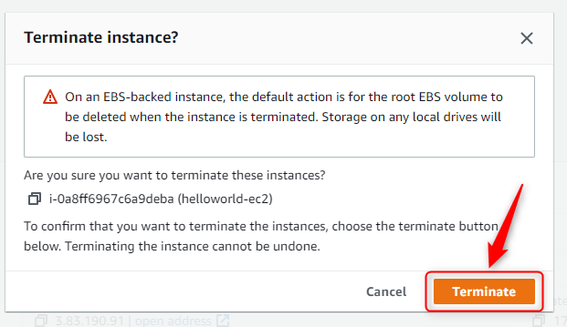