SAGE
-----

Steps:
1. Configure AWS User. This user doesn't have any permissions. Please check section **CONFIGURATION USER**
1. Configure AWS Role. This role is connected with user and has some specific permissions. Please check section **CONFIGURATION ROLE**
1. Configure AWS Console. The user logs in to AWS, switches role and gets permissions to specific services. Please check section **CONFIGURATION CONSOLE**


DESCRIPTION
-----------

##### Goal
The goal of this project is to present how to use **assume role** and then **switch role** in AWS Console.

**Assume Role** means that we create user without any role - just with credentials. Then we create some **custome role** and:
* Connect Role with User
* Connect Role with Permissions

In the result when user logs in to AWS Console and switch role then he/she will get permissions to some specific services. This is easy way for user and role management.

##### Technologies
This project uses following technologies:
* **AWS**


PRECONDITIONS
-------------

##### Preconditions - Tools

##### Preconditions - Actions
* Created AWS account 


CONFIGURATION USER
------------------

AWS Console:
* https://console.aws.amazon.com/

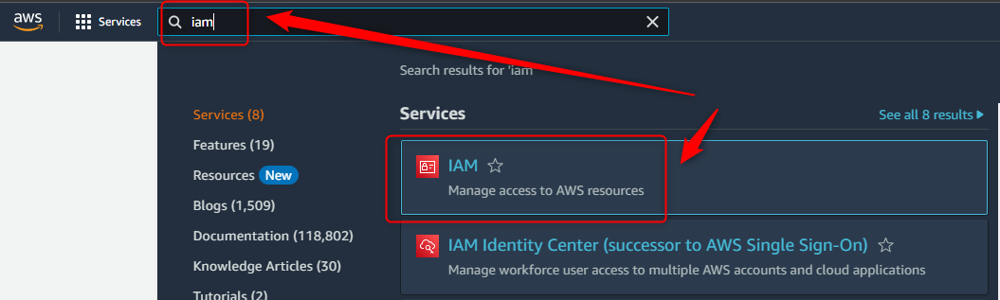

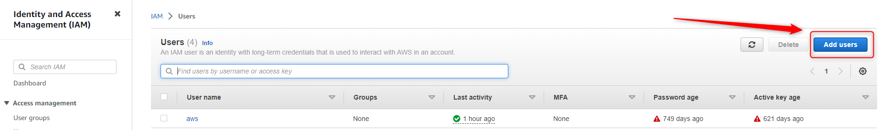

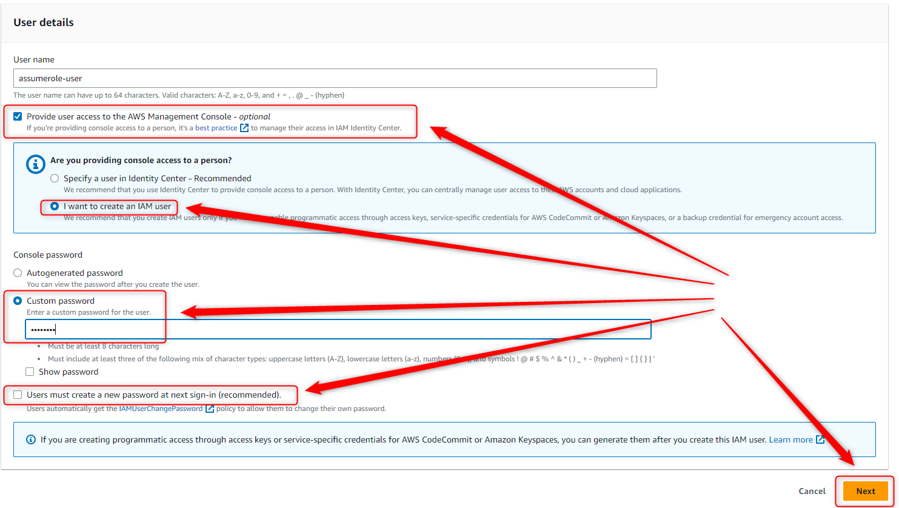

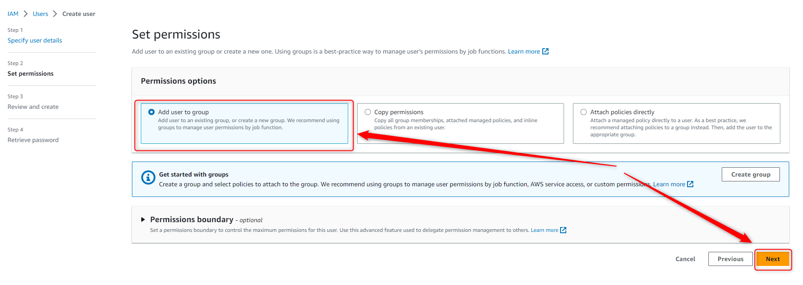


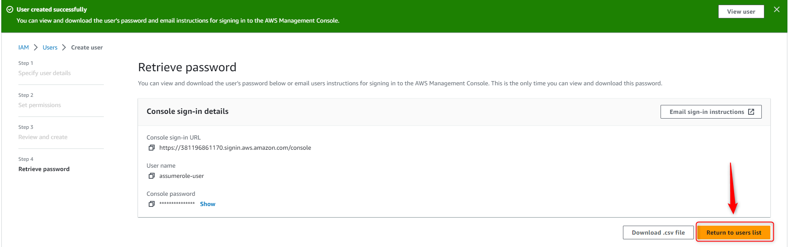

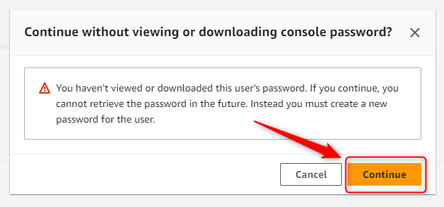

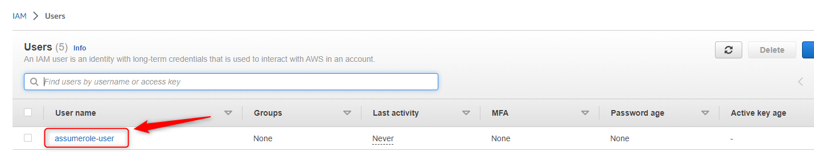

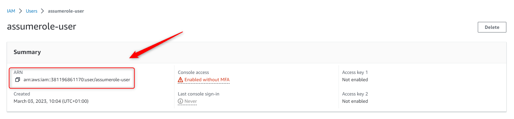


CONFIGURATION ROLE
------------------

AWS Console:
* https://console.aws.amazon.com/

Code:

```
{
	"Version": "2012-10-17",
	"Statement": [
		{
			"Sid": "Statement1",
			"Effect": "Allow",
			"Principal": {
			    "AWS": "arn:aws:iam::381196861170:user/assumerole-user"
			},
			"Action": "sts:AssumeRole"
		}
	]
}
```

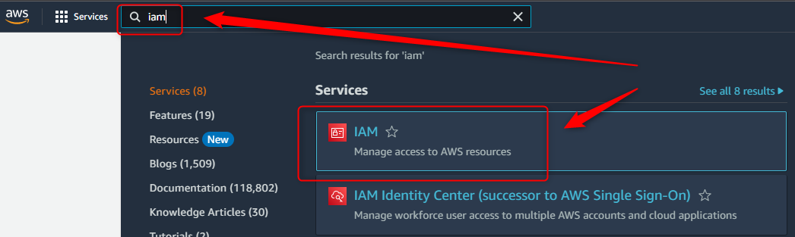

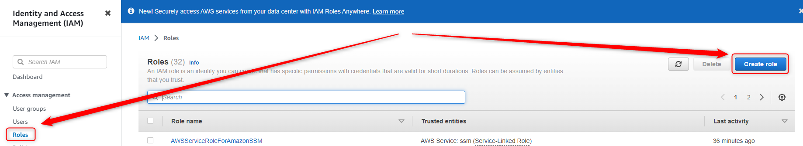


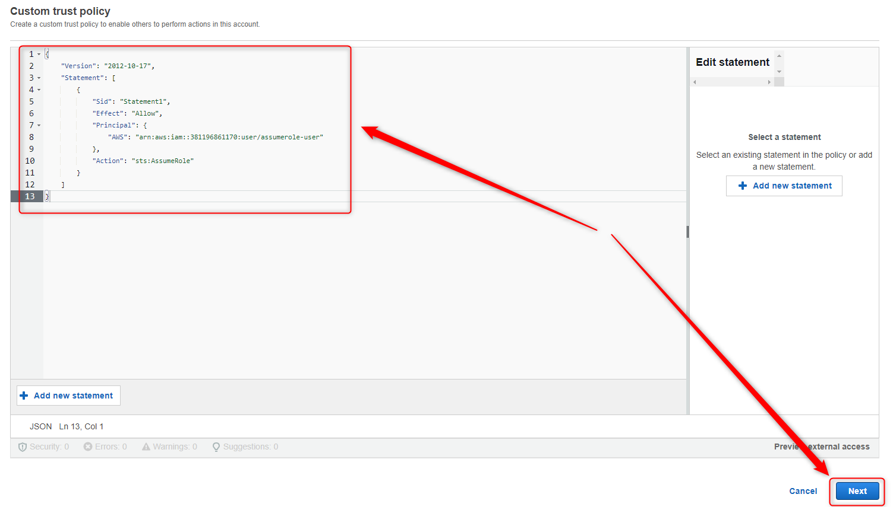

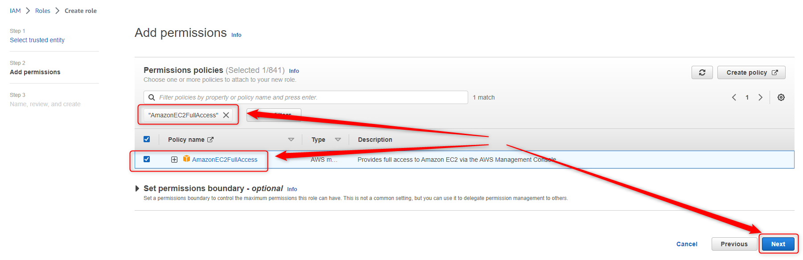

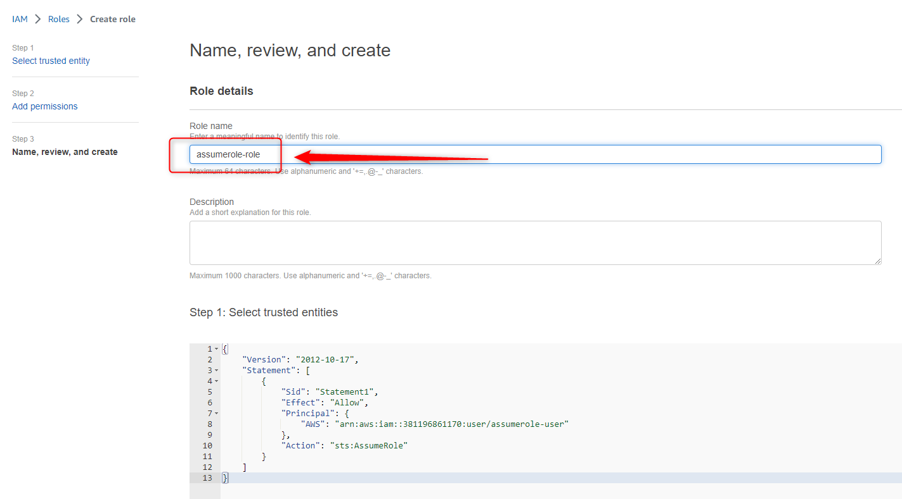

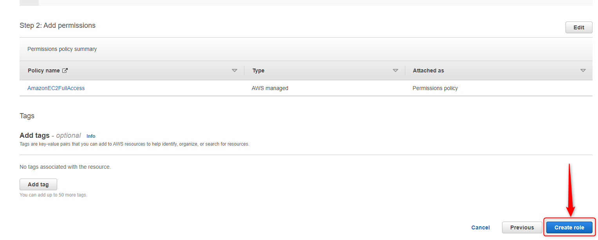

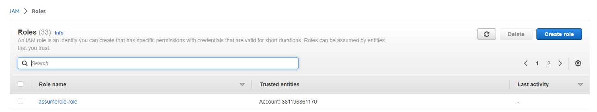


CONFIGURATION CONSOLE
---------------------

AWS Console:
* https://console.aws.amazon.com/

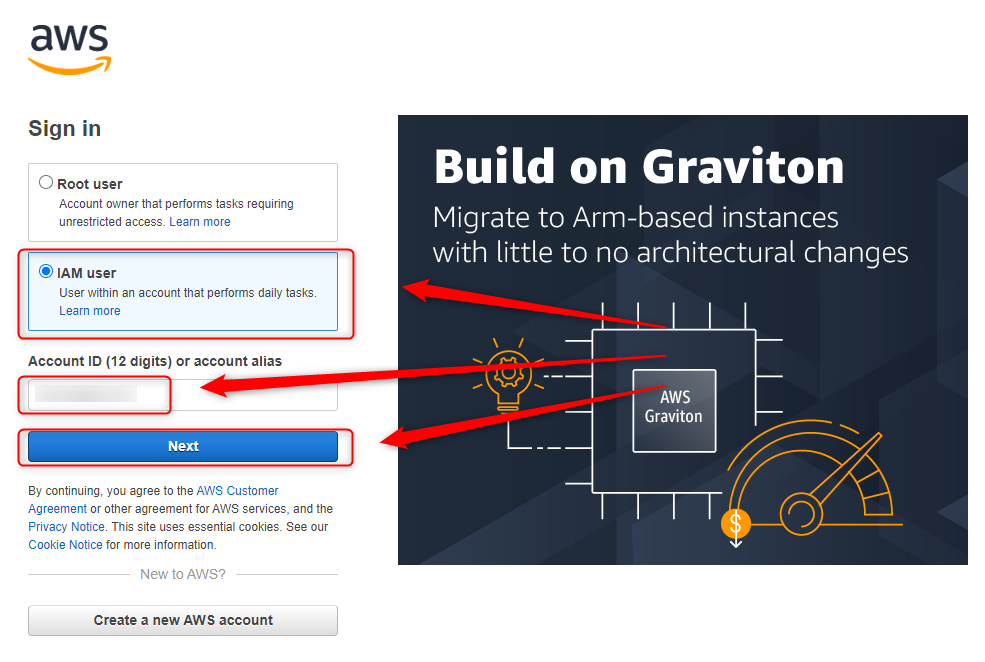

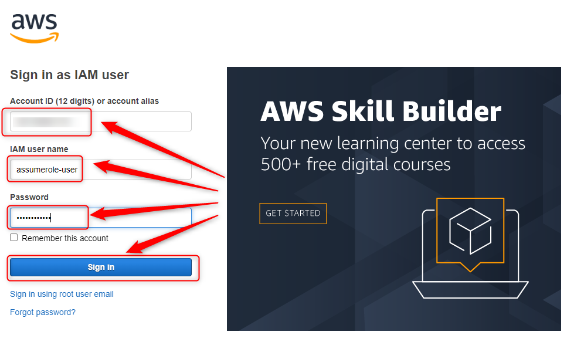

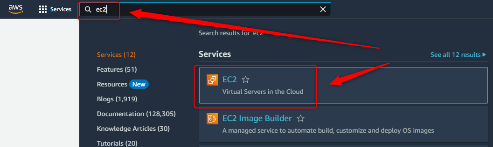

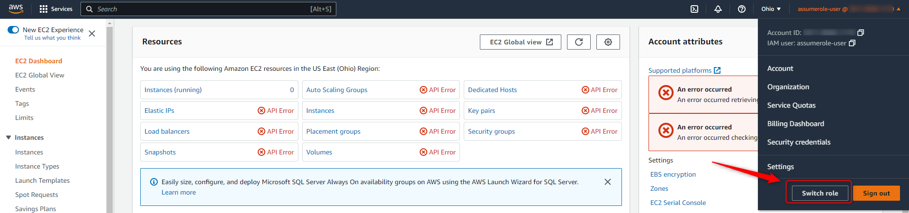

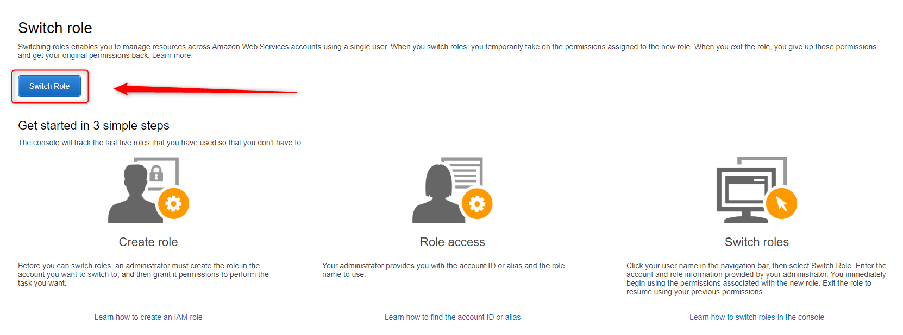

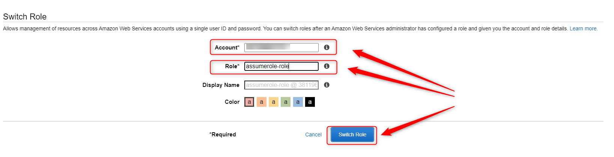

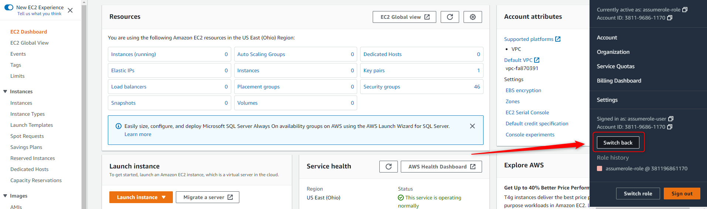